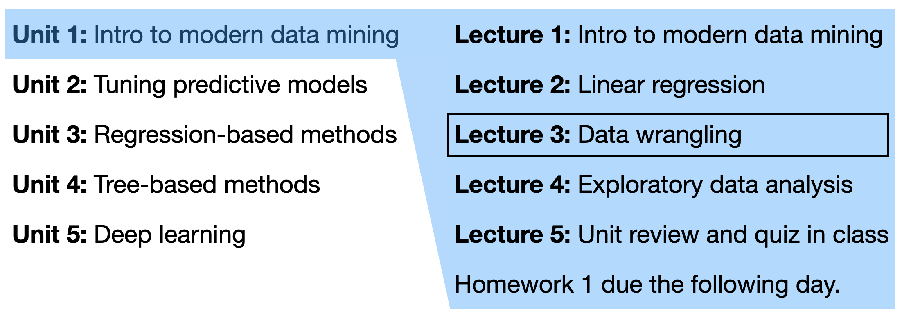

```{r setup, include=FALSE}
options(scipen = 0, digits = 3)  # controls number of significant digits printed
```

Welcome back to STAT 471! We are now in Unit 1 Lecture 3:

```{r, fig.align='center', out.width="75%", echo = FALSE}

```

This lecture is about *data wrangling*, "the art of getting your data into R in a useful form for visualization and modeling" (R4DS Chapter 9), drawing on Chapters 10, 11, 12, and 15 from the excellent R for Data Science book (direct quotations are presented using block quotes).

```{r, fig.align='center', out.width="75%",fig.cap = "Image source: R4DS Chapter 9.", echo = FALSE}
knitr::include_graphics("figures/data-science-wrangle.png")
```

We will cover:

- Tibbles (a representation of our data matrix in R)
- Data import (getting the data into R)
- Data tidying (getting our data into a format amenable to analysis)

Let's load the `tidyverse`:
```{r, message = FALSE}
library(tidyverse)
```

# Tibbles (R4DS Chapters 10 and 13)

A tibble is an upgraded version of R's data frame. When you read data into R using any `tidyverse` function it will be stored as a tibble. Here is an example of a tibble:
```{r}
mpg
```

## Tibble data types

Each column has a *data type*. The most common data types you will find are `logical` (`lgl`), `integer` (`int`), `double` (`dbl`), `character` (`chr`), and `factor` (`fctr`).

The `factor` type is a special type for handling categorical variables. Let's pull out the `class` variable from the data frame to explore:
```{r}
car_classes = mpg %>% pull(class) # pull out class variable
head(car_classes)                 # look at first entries
table(car_classes)                # tabulate 
```

Let's check out the type of `car_classes`:
```{r}
typeof(car_classes)
```

We can convert a character vector to a factor vector as follows:
```{r}
car_classes_factor = factor(car_classes)
head(car_classes_factor)
```

We see that a factor variable has *levels*: a list of the different categories. We can extract a factor's levels as follows:

```{r}
levels(car_classes_factor)
```

We may want to change one or more of the levels names using `fct_recode`:
```{r}
car_classes_recoded = 
  fct_recode(car_classes_factor,
             "two-seater"  = "2seater",
             "SUV"         = "suv")
levels(car_classes_recoded)
```

or change the order of the factor levels:
```{r}
car_classes_reordered = 
  factor(car_classes_factor, 
         levels = c("suv", 
                    "subcompact", 
                    "pickup", 
                    "minivan",
                    "midsize",
                    "compact", 
                    "2seater"))
levels(car_classes_reordered)
```

## Creating tibbles

Sometimes you'll need to create a tibble yourself. You can do so easily using the `tibble` command:
```{r}
tibble(x = rnorm(5),
       y = 1,
       z = x^2 + y)
```

It’s possible for a tibble to have column names that are not valid R variable names, aka *non-syntactic* names. For example, they might not start with a letter. To refer to these variables, you need to surround them with backticks:
```{r}
tb <- tibble(
  `:)` = "smile", 
  `2000` = "number"
)
tb
```
> Another way to create a tibble is with `tribble()`, short for transposed tibble. `tribble()` is customised for data entry in code: column headings are defined by formulas (i.e. they start with `~`), and entries are separated by commas. This makes it possible to lay out small amounts of data in easy to read form.

```{r}
tribble(
  ~x, ~y, ~z,
  #--|--|----
  "a", 2, 3.6,
  "b", 1, 8.5
)
```
> I often add a comment (the line starting with `#`), to make it really clear where the header is.

# Data import (R4DS Chapter 11)

Data come in several different formats, e.g. comma-separated values (csv), tab-separated values (tsv), or Excel files. To read files in csv or tsv formats, use `read_csv`and `read_tsv`, respectively. These are both part of the `readr` package, which is part of the `tidyverse`. These functions are very similar to each other. To read Excel files, use the `read_excel` function from the `readxl` package. 

Let's see how `read_csv` works. The simplest way of calling it is to specify just one argument (the location of the file you'd like to read):
```{r}
heights = read_csv("../../data/heights.csv")
heights
```
The assumption `read_csv` made is that the first line of the file are the column names. If column names are absent, make sure to specify this via `col_names = FALSE`. Note that `read_csv` has guessed the column types. Sometimes, it guesses wrong. Perhaps `sex` and `race` should be factors, and education and age should be integers. If there aren't too many columns, it's good practice to just specify the column types in the initial call to `read_csv` via the `col_types` argument:

```{r}
heights = read_csv("../../data/heights.csv",
                   col_types = "ddfiif")
heights
```
Sometimes the files you'd like to read contain headers, i.e. one or more lines of metadata before the actual data starts. In this case, you can either skip a fixed number of lines (e.g. the first three) via `skip = 3` or skip any lines starting with a certain character (e.g. `#`) via `comment = "#"`.

# Tidy data (R4DS Chapter 12)

> “Happy families are all alike; every unhappy family is unhappy in its own way.” –– Leo Tolstoy
>
>“Tidy datasets are all alike, but every messy dataset is messy in its own way.” –– Hadley Wickham
>
> In this chapter, you will learn a consistent way to organise your data in R, an organisation called tidy data. Getting your data into this format requires some upfront work, but that work pays off in the long term. Once you have tidy data and the tidy tools provided by packages in the tidyverse, you will spend much less time munging data from one representation to another, allowing you to spend more time on the analytic questions at hand.

## Tidy data

There are multiple ways to represent the same data:
```{r}
table1

table2

table3

table4a
table4b
```

> These are all representations of the same underlying data, but they are not equally easy to use. One dataset, the tidy dataset (`table1`), will be much easier to work with inside the tidyverse.
>
>There are three interrelated rules which make a dataset tidy:
>
1. Each variable must have its own column.
2. Each observation must have its own row.
3. Each value must have its own cell.
> The figure below shows the rules visually.

```{r, fig.align='center', out.width="100%", echo = FALSE}
knitr::include_graphics("figures/tidy-data.png")
```

All the packages in the `tidyverse` are designed to work with tidy data. The `tidyr` package is designed to get non-tidy data into tidy format.

### Exercise

Using prose, describe how the variables and observations are organised in each of the sample tables.

## Pivoting

Once you get a non-tidy dataset, the first step is to figure out what the variables and observations are. Then, you want to get the variables into columns and get observations into rows. 

- If one variable is spread across multiple columns, you'll need to `pivot_longer`.
- If one observation is scattered across multiple rows, you'll need to `pivot_wider`.

### Longer

> A common problem is a dataset where some of the column names are not names of variables, but *values* of a variable. Take `table4a`: the column names `1999` and `2000` represent values of the year variable, the values in the `1999` and `2000` columns represent values of the cases variable, and each row represents two observations, not one.

```{r}
table4a
```

> To tidy a dataset like this, we need to **pivot** the offending columns into a new pair of variables. To describe that operation we need three parameters:
> 
- The set of columns whose names are values, not variables. In this example, those are the columns `1999` and `2000`.
- The name of the variable to move the column names to. Here it is `year`.
- The name of the variable to move the column values to. Here it’s `cases`.

> Together those parameters generate the call to `pivot_longer()`:

```{r}
table4a %>% 
  pivot_longer(c(`1999`, `2000`), names_to = "year", values_to = "cases")
```

>  Note that “1999” and “2000” are non-syntactic names (because they don’t start with a letter) so we have to surround them in backticks.

> In the final result, the pivoted columns are dropped, and we get new year and cases columns. Otherwise, the relationships between the original variables are preserved. Visually, this is shown in the figure below.

```{r, fig.align='center', out.width="100%", echo = FALSE}
knitr::include_graphics("figures/pivot-longer.png")
```

> We can use `pivot_longer()` to tidy `table4b` in a similar fashion. The only difference is the variable stored in the cell values:

```{r}
table4b %>% 
  pivot_longer(c(`1999`, `2000`), names_to = "year", values_to = "population")
```

> To combine the tidied versions of `table4a` and `table4b` into a single tibble, we need to use `dplyr::left_join()`:

```{r}
tidy4a <- table4a %>% 
  pivot_longer(c(`1999`, `2000`), names_to = "year", values_to = "cases")
tidy4b <- table4b %>% 
  pivot_longer(c(`1999`, `2000`), names_to = "year", values_to = "population")
left_join(tidy4a, tidy4b, by = c("country", "year"))
```
Read more about combining multiple datasets in Chapter 13 of R4DS.

### Wider

> `pivot_wider()` is the opposite of `pivot_longer()`. You use it when an observation is scattered across multiple rows. For example, take `table2`: an observation is a country in a year, but each observation is spread across two rows.

```{r}
table2
```

> To tidy this up, we first analyse the representation in similar way to `pivot_longer()`. This time, however, we only need two parameters:
>
- The column to take variable names from. Here, it’s `type`.
- The column to take values from. Here it’s `count`.

Once we’ve figured that out, we can use `pivot_wider()`. 

```{r}
table2 %>%
    pivot_wider(names_from = type, values_from = count)
```

```{r, fig.align='center', out.width="100%", echo = FALSE}
knitr::include_graphics("figures/pivot-wider.png")
```

### Exercises

1. Why does this code fail?
```{r, eval = FALSE}
table4a %>% 
  pivot_longer(c(1999, 2000), names_to = "year", values_to = "cases")
# Error: Can't subset columns that don't exist. 
# Locations 1999 and 2000 don't exist.
# There are only 3 columns.
```

2. What would happen if you widen this table? Why? How could you add a new column to uniquely identify each value?
```{r}
tribble(
  ~name,             ~names,  ~values,
  #-----------------|--------|------
  "Phillip Woods",   "age",       45,
  "Phillip Woods",   "height",   186,
  "Phillip Woods",   "age",       50,
  "Jessica Cordero", "age",       37,
  "Jessica Cordero", "height",   156
) 
```

3. Tidy the simple tibble below. Do you need to make it wider or longer? What are the variables?
```{r}
tribble(
  ~pregnant, ~male, ~female,
  "yes",     NA,    10,
  "no",      20,    12
)
```

## Separating

> So far you’ve learned how to tidy `table2` and `table4`, but not `table3`. `table3` has a different problem: we have one column (`rate`) that contains two variables (`cases` and `population`). To fix this problem, we’ll need the `separate()` function. 

> `separate()` pulls apart one column into multiple columns, by splitting wherever a separator character appears. Take `table3`:

```{r}
table3
```

> The `rate` column contains both `cases` and `population` variables, and we need to split it into two variables. `separate()` takes the name of the column to separate, and the names of the columns to separate into, as shown below. 

```{r}
table3 %>% 
  separate(rate, into = c("cases", "population"))
```
```{r, fig.align='center', out.width="100%", echo = FALSE}
knitr::include_graphics("figures/separate.png")
```

> By default, `separate()` will split values wherever it sees a non-alphanumeric character (i.e. a character that isn’t a number or letter). For example, in the code above, `separate()` split the values of rate at the forward slash characters. If you wish to use a specific character to separate a column, you can pass the character to the sep argument of `separate()`. For example, we could rewrite the code above as:

```{r}
table3 %>% 
  separate(rate, into = c("cases", "population"), sep = "/")
```
> Look carefully at the column types: you’ll notice that `cases` and `population` are character columns. This is the default behaviour in `separate()`: it leaves the type of the column as is. Here, however, it’s not very useful as those really are numbers. We can ask `separate()` to try and convert to better types using `convert = TRUE`:

```{r}
table3 %>% 
  separate(rate, into = c("cases", "population"), convert = TRUE)
```

> You can also pass a vector of integers to `sep`. `separate()` will interpret the integers as positions to split at. Positive values start at 1 on the far-left of the strings; negative value start at -1 on the far-right of the strings. When using integers to separate strings, the length of `sep` should be one less than the number of names in into.

> You can use this arrangement to separate the last two digits of each year. This make this data less tidy, but is useful in other cases, as you’ll see in a little bit.

```{r}
table3 %>% 
  separate(year, into = c("century", "year"), sep = 2)
```

## Missing values

> Changing the representation of a dataset brings up an important subtlety of missing values. Surprisingly, a value can be missing in one of two possible ways:
>
- Explicitly, i.e. flagged with NA.
- Implicitly, i.e. simply not present in the data.
Let’s illustrate this idea with a very simple data set:

```{r}
stocks <- tibble(
  year   = c(2015, 2015, 2015, 2015, 2016, 2016, 2016),
  qtr    = c(   1,    2,    3,    4,    2,    3,    4),
  return = c(1.88, 0.59, 0.35,   NA, 0.92, 0.17, 2.66)
)
```

> There are two missing values in this dataset:
>
- The return for the fourth quarter of 2015 is explicitly missing, because the cell where its value should be instead contains `NA`.
- The return for the first quarter of 2016 is implicitly missing, because it simply does not appear in the dataset.

> One way to think about the difference is with this Zen-like koan: An explicit missing value is the presence of an absence; an implicit missing value is the absence of a presence.

> The way that a dataset is represented can make implicit values explicit. For example, we can make the implicit missing value explicit by putting years in the columns:

```{r}
stocks %>% 
  pivot_wider(names_from = year, values_from = return)
```

> Because these explicit missing values may not be important in other representations of the data, you can set `values_drop_na = TRUE` in `pivot_longer()` to turn explicit missing values implicit:

## Case study

> Let’s pull together everything you’ve learned to tackle a realistic data tidying problem. The tidyr::who dataset contains tuberculosis (TB) cases broken down by year, country, age, gender, and diagnosis method. The data comes from the 2014 World Health Organization Global Tuberculosis Report, available at [http://www.who.int/tb/country/data/download/en/](http://www.who.int/tb/country/data/download/en/).

> There’s a wealth of epidemiological information in this dataset, but it’s challenging to work with the data in the form that it’s provided:

```{r}
who
```

Let's work together to try to tidy it!!!

