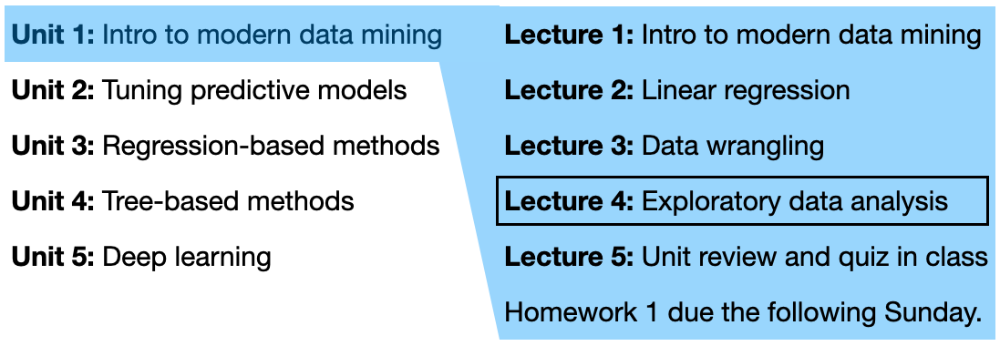
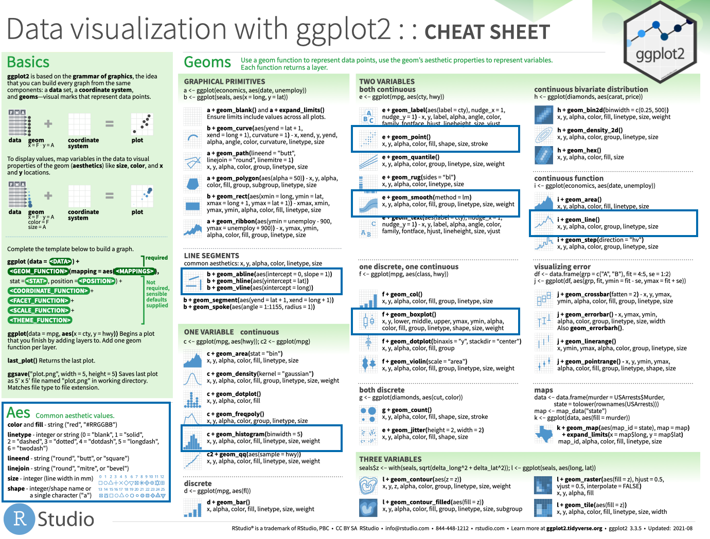
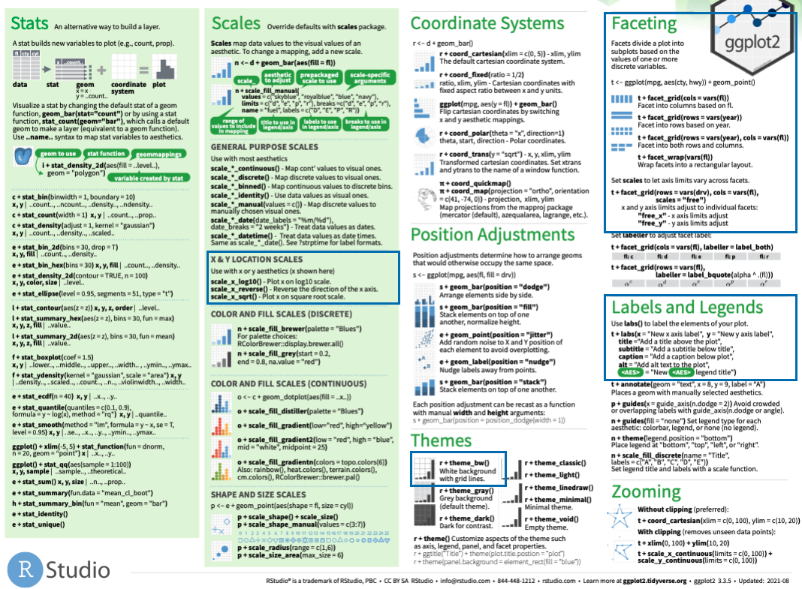
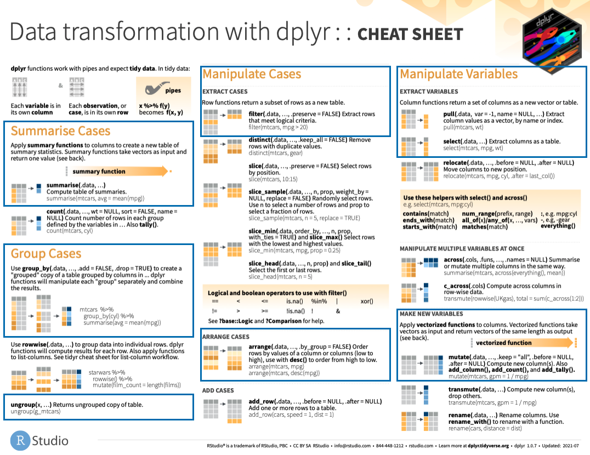

```{r setup, include=FALSE}
options(scipen = 0, digits = 3)  # controls number of significant digits printed
```

Welcome back to STAT 471! We are now in Unit 1 Lecture 4:

```{r, fig.align='center', out.width="75%", echo = FALSE}

```

This lecture is about *exploratory data analysis*, which involves data transformation and visualization. It draws on Chapters 3, 5, and 7 from the excellent R for Data Science book (direct quotations are presented using block quotes).

```{r, fig.align='center', out.width="75%",fig.cap = "Image source: R4DS Chapter 2.", echo = FALSE}
knitr::include_graphics("figures/data-science-explore.png")
```

As usual, let's load the `tidyverse`:
```{r, message = FALSE}
library(tidyverse)
```

# Data visualization

> R has several systems for making graphs, but `ggplot2` [one of the core members of the `tidyverse`] is one of the most elegant and most versatile. `ggplot2` implements the grammar of graphics, a coherent system for describing and building graphs. With `ggplot2`, you can do more faster by learning one system and applying it in many places.

## `ggplot` basics

Let's recall the `mpg` data frame from last lecture:
```{r}
mpg
```

Let's plot the relationship between `displ` (a car's engine size in liters) and `hwy` (a car's fuel efficiency on the highway, in miles per gallon). 

```{r}
mpg %>%                           # pipe in the data
  ggplot() +                      # create an empty ggplot
  geom_point(mapping =            # add scatter plot
               aes(x = displ,     # x axis location of points
                   y = hwy))      # y axis location of points
```

An *aesthetic* is a visual property of the objects in your plot. We create a plot by *mapping* variables in our tibble to aesthetics of the plot. In the above case, we `displ` is mapped to `x` (the horizontal axis position) and `hwy` is mapped to `y` (the vertical axis position). A *geom* function adds a specific representation of the data to the plot (scatter plot, box plot, etc). In the above case, we used `geom_point` to create a scatter plot. A plot can have multiple geoms and multiple aesthetics. The plot above contains only one *panel*, but multi-panel plots can be created using *faceting*. 

```{r, fig.align='center', out.width="100%",fig.cap = "Image source: https://www.rstudio.com/resources/cheatsheets/", echo = FALSE}

```

```{r, fig.align='center', out.width="100%",fig.cap = "Image source: https://www.rstudio.com/resources/cheatsheets/", echo = FALSE}

```

\clearpage

## Aesthetics

Let's see some examples of different aesthetics we can add to the above scatter plot.

Adding a color aesthetic:
```{r}
mpg %>%                            # pipe in the data
  ggplot() +                       # create an empty ggplot
  geom_point(mapping =             # add scatter plot
               aes(x = displ,      # x axis location of points
                   y = hwy,        # y axis location of points
                   color = class)) # color of points     
```

Adding a size aesthetic:
```{r}
mpg %>%                            # pipe in the data
  ggplot() +                       # create an empty ggplot
  geom_point(mapping =             # add scatter plot
               aes(x = displ,      # x axis location of points
                   y = hwy,        # y axis location of points
                   size = class))  # size of points     
```

Adding a shape aesthetic:
```{r}
mpg %>%                            # pipe in the data
  ggplot() +                       # create an empty ggplot
  geom_point(mapping =             # add scatter plot
               aes(x = displ,      # x axis location of points
                   y = hwy,        # y axis location of points
                   shape = class)) # size of points     
```

Adding a transparency aesthetic:
```{r}
mpg %>%                            # pipe in the data
  ggplot() +                       # create an empty ggplot
  geom_point(mapping =             # add scatter plot
               aes(x = displ,      # x axis location of points
                   y = hwy,        # y axis location of points
                   alpha = class)) # transparency of points     
```


Specifying an aesthetic manually, instead of mapping from a variable:
```{r}
mpg %>%                            # pipe in the data
  ggplot() +                       # create an empty ggplot
  geom_point(mapping =             # add scatter plot
               aes(x = displ,      # x axis location of points
                   y = hwy),       # y axis location of points
             color = "blue")       # color of points (outside of aes)
```

## Exercises

1. What’s gone wrong with this code? Why are the points not blue?

```{r}
mpg %>%
  ggplot() + 
  geom_point(mapping = aes(x = displ, y = hwy, color = "blue"))
```

2. Map a continuous variable to `color`, `size`, and `shape`. How do these aesthetics behave differently for categorical vs. continuous variables?

3. What happens if you map the same variable to multiple aesthetics?

4. What happens if you map an aesthetic to something other than a variable name, like `aes(colour = displ < 5)`? Note, you’ll also need to specify `x` and `y`.

## Facets

> To facet your plot by a single variable, use `facet_wrap()`. The first argument of `facet_wrap()` should be a formula, which you create with `~` followed by a variable name (here “formula” is the name of a data structure in R, not a synonym for “equation”). The variable that you pass to `facet_wrap()` should be discrete.

```{r}
mpg %>%                         # pipe in the data
  ggplot() +                    # create empty ggplot
  geom_point(mapping =          # create scatter plot
               aes(x = displ,   # map displ to x axis location
                   y = hwy)) +  # map hwy to y axis location
  facet_wrap(~ class,           # split into facets based on class
             nrow = 2)          # have two rows of facets
```

> To facet your plot on the combination of two variables, add `facet_grid()` to your plot call. The first argument of `facet_grid()` is also a formula. This time the formula should contain two variable names separated by a `~`.

```{r}
mpg %>%
  ggplot() + 
  geom_point(mapping = 
               aes(x = displ, y = hwy)) + 
  facet_grid(drv ~ cyl)                     # facet on drv and cyl
```

If you prefer to not facet in the rows or columns dimension, use a `.` instead of a variable name, e.g. `+ facet_grid(. ~ cyl)`.

## Exercises

1. What happens if you facet on a continuous variable?

2. Why are there empty facets in the plot with `facet_grid(drv ~ cyl)`?

3. Read `?facet_wrap`. What does `nrow` do? What does `ncol` do? Why doesn’t `facet_grid()` have `nrow` and `ncol` arguments?

## geoms

To visualize the distribution of a quantitative variable:

```{r}
mpg %>%
  ggplot() + 
  geom_histogram(aes(x = hwy)) # we usually drop "mapping =" 
```

To visualize the distribution of a categorical variable:

```{r}
# bar plot
mpg %>%
  ggplot() + 
  geom_bar(aes(x = class)) 

# better to reorder class variable
mpg %>%
  ggplot() + 
  geom_bar(aes(x = fct_infreq(class))) 
```

To visualize the relationship between a quantitative and categorical variable:
```{r}
# boxplot
mpg %>%
  ggplot() + 
  geom_boxplot(aes(x = class, y = hwy))

# better to reorder factors based on hwy
mpg %>%
  ggplot() + 
  geom_boxplot(aes(x = fct_reorder(class, hwy), y = hwy))
```

To add a smooth curve:

```{r}
mpg %>%
  ggplot() + 
  geom_point(aes(x = displ, y = hwy)) +              # create scatter plot
  geom_smooth(aes(x = displ, y = hwy), se = FALSE)   # add smooth curve
```

Can instead set aesthetic mapping *globally*:
```{r}
mpg %>%
  ggplot(aes(x = displ, y = hwy)) + # set aesthetic mapping globally
  geom_point() +                    # add scatter plot
  geom_smooth(se = FALSE)           # add smooth curve
```

Can set some aesthetic mappings globally and some locally:
```{r}
mpg %>%
  ggplot(aes(x = displ, y = hwy)) + # set x and y aesthetic mappings globally
  geom_point(aes(color = class)) +  # set color aesthetic mapping locally
  geom_smooth(se = FALSE)           # add smooth curve
```

If we had set `color` aesthetic globally, ggplot would separate smooth curves by `class`:
```{r}
mpg %>%
  ggplot(aes(x = displ, y = hwy, color = class)) + # set x, y, color aesthetic 
  geom_point() +                                   #  mappings globally
  geom_smooth(se = FALSE)           
```

Add horizontal, vertical, and/or oblique lines:
```{r}
mpg %>%
  ggplot(aes(x = displ, y = hwy)) + # set aesthetic mapping globally
  geom_point() +                    # add scatter plot
  geom_smooth(se = FALSE) +         # add smooth curve
  geom_vline(xintercept = 4,        # add vertical line with x-intercept 4
             linetype = "dashed",
             color = "red") +       
  geom_hline(yintercept = 20,       # add horizontal line with y-intercept 20
             linetype = "dashed",
             color = "red") + 
  geom_abline(slope = 10,           # add oblique line with slope 10 
              intercept = 2,        #  and y-intercept 2
              linetype = "solid",
              color = "red")        

```

## Themes

Different pre-set "themes" give plots different appearances. A theme I prefer to use is `theme_bw()`:

```{r}
mpg %>%
  ggplot(aes(x = displ, y = hwy)) + # set aesthetic mapping globally
  geom_point() +                    # add scatter plot
  geom_smooth(se = FALSE) +         # add smooth curve
  geom_vline(xintercept = 4,        # add vertical line with x-intercept 4
             linetype = "dashed",
             color = "red") +       
  geom_hline(yintercept = 20,       # add horizontal line with y-intercept 20
             linetype = "dashed",
             color = "red") + 
  geom_abline(slope = 10,           # add oblique line with slope 10 
              intercept = 2,        #  and y-intercept 2
              linetype = "solid",
              color = "red") +
  theme_bw()                        # add classy bw theme
```

## High-quality figures for communication

See [preparing-reports.pdf](https://github.com/Katsevich-Teaching/stat-471-fall-2021/blob/main/getting-started/preparing-reports.pdf). Part of your homework will be graded on presentation quality.

# Data transformation

The `dplyr` package (another core member of the `tidyverse`) facilitates manipulation of data. This includes key operations:

- Pick observations by their values (`filter()`).
- Reorder the rows (`arrange()`).
- Pick variables by their names (`select()`).
- Create new variables with functions of existing variables (`mutate()`).
- Collapse many values down to a single summary (`summarise()`).

These can all be used in conjunction with `group_by()` which changes the scope of each function from operating on the entire dataset to operating on it group-by-group. These six functions provide the verbs for a language of data manipulation.

```{r, fig.align='center', out.width="100%",fig.cap = "Image source: https://www.rstudio.com/resources/cheatsheets/", echo = FALSE}

```

\clearpage

## Filter rows with `filter()`

```{r}
mpg %>% 
  filter(class == "compact")
```

```{r}
mpg %>% 
  filter(class %in% c("compact", "2seater"))
```

```{r}
mpg %>% 
  filter(class %in% c("compact", "2seater") & year > 2000) # & means "and"
```

## Exercises

1. Find all cars manufactured by a Japanese company (`Honda`, `Toyota`, `Nissan`, `Subaru`). How many such cars are there in these data?

2. Find all cars whose highway fuel efficiency (`hwy`) exceeded their city fuel efficiency (`cty`) by at least a factor of 1.5. How many such cars are there in these data?

```{r}
mpg %>% 
  filter(class %in% c("compact", "2seater") | year > 2000) # | means "or"
```


## Arrange rows with `arrange()`

You can sort the rows of a tibble according to the values of a certain variable:

```{r}
mpg %>% arrange(hwy)
```

Or in descending order:
```{r}
mpg %>% arrange(desc(hwy))
```

Which car had the best highway fuel efficiency?

## Select columns with `select()`

Select columns:
```{r}
mpg %>% select(manufacturer, model, year)
```

De-select columns:
```{r}
mpg %>% select(-manufacturer, -model, -year)
```

## Add new variables with `mutate()`

```{r}
mpg_small = mpg %>% select(manufacturer, model, year, cty, hwy)
mpg_small %>%
  mutate(hwy_boost = hwy - cty,
         japanese = manufacturer %in% c("Honda", "Toyota", "Nissan", "Subaru"))
```

## Grouped summaries with `summarise()`

Extract mean fuel economy for cities and highways:
```{r}
mpg %>% 
  summarise(mean_cty = mean(cty),
            mean_hwy = mean(hwy))
```

Extract mean fuel economy for cities and highways, by car `class`:
```{r}
mpg %>% 
  group_by(class) %>%
  summarise(mean_cty = mean(cty),
            mean_hwy = mean(hwy))
```

Note that we strung together two operations using the pipe. We can string together arbitrarily many operations using the pipe, including plotting:
```{r}
mpg %>% 
  group_by(class) %>%
  summarise(mean_cty = mean(cty),
            mean_hwy = mean(hwy)) %>%
  ggplot(aes(x = mean_cty, y = mean_hwy, label = class)) +
  geom_point() + 
  ggrepel::geom_text_repel() +
  labs(x = "Mean city fuel economy (gallons per mile)",
       y = "Mean highway fuel economy (gallons per mile)") + 
  theme_bw() 
```

Common functions used with `summarise()`: `mean`, `median`, `sum`, `min`, `max`, `n`, `sd`, ...

# Exploratory data analysis

All these visualizations and transformations can help us to explore the data and find interesting patterns. 

## Relationship between engine size and fuel economy

What is the relationship between `displ` (a car's engine size in liters) and `hwy` (a car's fuel efficiency on the highway, in miles per gallon)? We created the plot below already:
```{r}
mpg %>%                          
  ggplot(aes(x = displ, y = hwy)) +                      
  geom_point(aes(color = class)) + 
  geom_smooth(se = FALSE)
```

Note that the smooth curve is first decreasing but then increasing. What would we expect the relationship to be between `hwy` and `displ`? What color points seem to be "pulling up" the smooth curve fit? Why might this be the case?

## Fuel economy in cities versus on highways

What is the relationship between fuel economy in cities and on highways?

## Comparing manufacturers based on fuel economy

Which manufacturers had the best and worst highway fuel economy in the year 1999, on average over models? What about the year 2008?