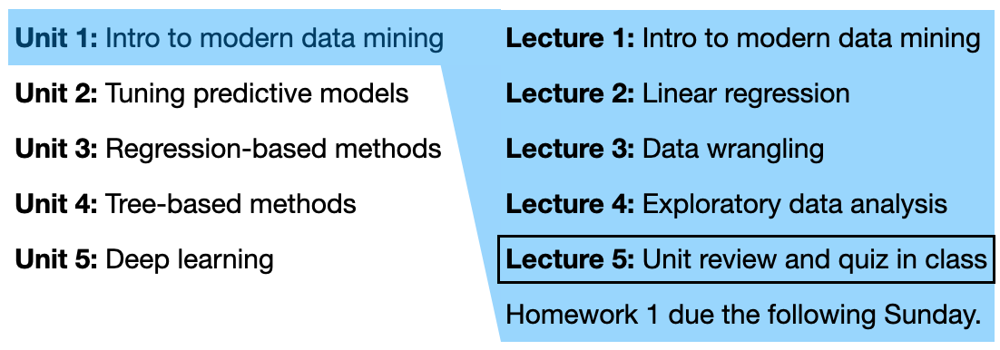

```{r setup, include=FALSE}
options(scipen = 0, digits = 3)  # controls number of significant digits printed
```

Welcome back to STAT 471! We are now in Unit 1 Lecture 5:

```{r, fig.align='center', out.width="75%", echo = FALSE}

```

In this lecture, we will review Unit 1, including data wrangling, manipulation, visualization, and linear regression modeling. We will do so by analyzing some data on tuberculosis from the WHO, available at https://www.who.int/teams/global-tuberculosis-programme/data.

As usual, let's load the `tidyverse`:
```{r, message = FALSE}
library(tidyverse)
```

# Data wrangling

```{r}
# read in the data and data dictionary
who_raw = read_csv("https://extranet.who.int/tme/generateCSV.asp?ds=notifications")
who_dictionary = read_csv("https://extranet.who.int/tme/generateCSV.asp?ds=dictionary")

# subset columns to reduce complexity (for the purposes of this class)
who = who_raw %>% select(colnames(tidyr::who))

# subset data dictionary 
who_dictionary %>% filter(variable_name %in% colnames(who)) %>% select(-dataset, -code_list)
```

# Data exploration

# Data modeling


